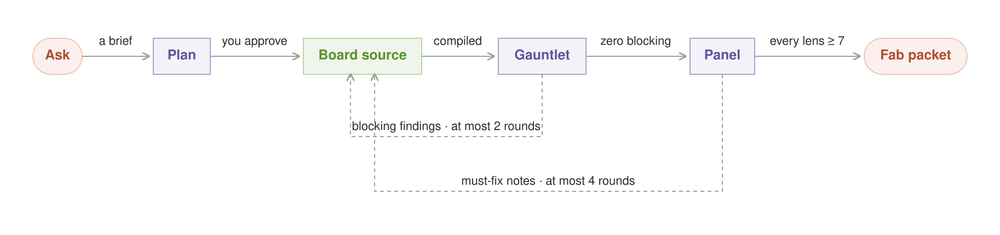
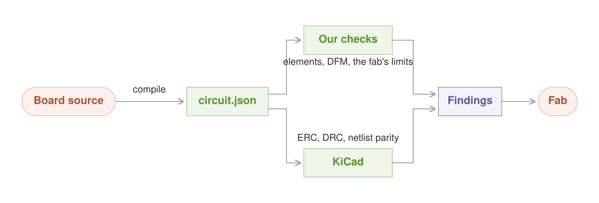
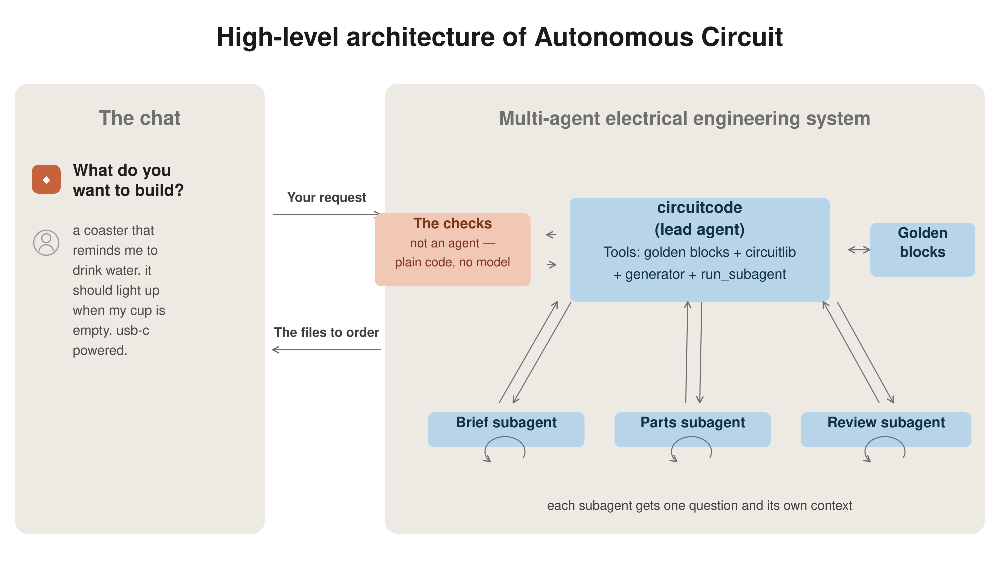
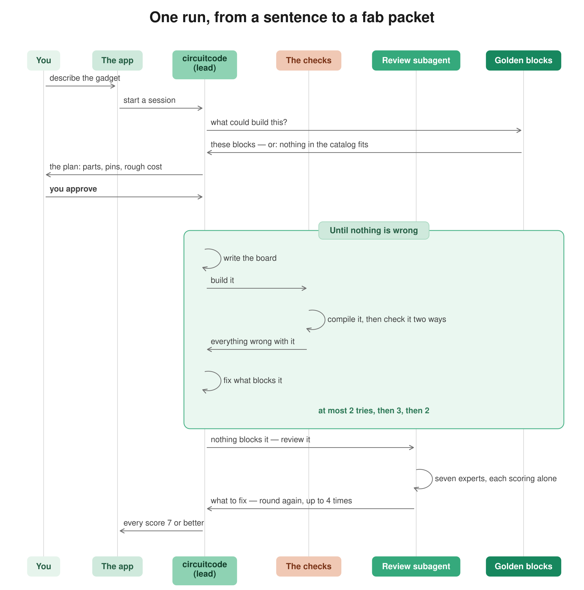

# Autonomous Circuit: chat with AI → a board you can order

[**Quickstart**](#quickstart) · [How it works](#how-a-board-gets-made) · [The agents](#five-agents-one-job-each) · [The loops](#four-loops-each-one-fixes-a-different-thing) · [Golden blocks](#golden-blocks-compose-never-invent) · [Where it stands](#where-it-actually-stands) · [Contributing](#contributing)

**You describe a gadget. You get back a circuit board you can order.**

Type what you want. Circuit asks a few questions, shows you a plan, and after you say yes it
designs the board and hands you the files a factory needs: the copper layers, the parts list with
part numbers you can actually buy, and where each part goes. Upload those to JLCPCB and the boards
show up in about two weeks.

It's a web app. Chat on the left, the board on the right — schematic, layout, 3D, parts, files.
The layout is not a one-shot picture: turn on **Move**, click a component, then drag it or nudge it
on a 0.25mm grid. Circuit previews the ratsnest, nearby-part clearance, and board-edge violations.
Sending the staged move through chat updates the board's source placement and rebuilds routing and
verification; it never edits the generated `circuit.json` artifact in place. This is the same
human-in-the-loop escape hatch that PCB engineers expect from desktop CAD, while keeping the result
reproducible.

Two things make it work. Boards are built out of **nine circuits we already know are right**,
rather than made up from datasheets each time. And every board is checked twice, by two programs
that share no code, before anyone is told it's ready.

Here's the catch, up front: nine blocks is not many. Circuit designs the kind of board those blocks
cover — USB-C power, 3.3V logic, an RP2040 chip, I²C sensors, buttons, LEDs. Ask for a motor driver
and it will tell you it can't, instead of guessing.

**That refusal is the point.** A wrong resistor looks exactly like a right one. It looks fine in the
schematic, fine in 3D, fine in every check we run, and fine in the files we send. You find out two
weeks later when the boards arrive and don't work.

---

## Quickstart

Requires Python 3.10+, Node 20+, and a `claude` CLI on your PATH.

```bash
git clone https://github.com/autonomous-ai/autonomous-circuit
cd autonomous-circuit
./scripts/dev.sh          # installs the pinned toolchain, starts the app on :4179
```

Open `http://localhost:4179`, pick a starter project, and type what you want. A three-block board
takes about 90 seconds to build; a 400-trace keyboard at maximum router effort takes about 20
minutes.

To build a board from the command line without the app:

```bash
python skills/circuitcode/scripts/circuit boards/main.tsx
# {"ok": true, "fab": {"ready": false}, "warnings": 12, ...}
```

`kicad-cli` is optional only for local authoring and required for every fab-ready result and CI
acceptance. Without it the pipeline can still build a diagnostic artifact, but the gerbers come
from a single exporter with nothing independent to check them against; the result remains
`fab.ready=false` and `ORDER.md` is not written.

---

## How a board gets made



Six steps. Two of them hand the work back.

**You ask, and get a plan.** `circuit-analysis` turns "a coaster that reminds me to drink water"
into a list of what the board actually needs: the parts, how much power, how big. `circuitcode`
turns that into a plan — which blocks, which pin goes where, roughly what it costs. **You approve
the plan before any board exists.** A plan takes a minute to argue with. A finished board takes
twenty.

**Then it writes the board.** Not in a CAD tool — in code. [tscircuit](https://github.com/tscircuit/tscircuit)
is React for circuit boards: parts are elements, wires are props, and the layout gets computed.
This is the trick that makes any of this work. A board written as code is a thing an AI is already
good at.

**Then it gets checked.** Compile the board, then grade it. That's the next section.

**Then it gets reviewed.** Once nothing is broken, seven reviewers look at it. Checks ask "is this
legal?" Reviewers ask "will this actually work, and can we build a hundred of them?"

**Then you get the files.** Circuit only writes the ordering instructions when the board is really
ready to order.

---

## The AI never decides if the board is good

Everything else in this repo follows from that one rule.



An AI writes the board. An AI fixes the board. **No AI ever gets to say the board is fine.** Every
verdict comes from plain code reading the files on disk. The AI's job is to react to what that code
found.

The reason is simple. Ask a model to check its own work and it re-runs the same thinking that
produced the work, so it makes the same mistakes twice and feels confident both times. On a circuit
board you don't catch that. Put a 10Ω resistor where a 10kΩ belongs and the schematic looks right,
the 3D view looks right, every check passes. The board is beautiful and dead.

So Circuit compiles the design once, then grades that one file twice, down two paths that share no
code:

- **Our checks** — read every element, run `@tscircuit/checks`, then measure the board against what
  the factory can actually make: traces and gaps at least 0.127mm, drills at least 0.3mm, copper no
  closer than 0.28mm to a plated hole, and so on.
- **KiCad** — the same design is converted to KiCad files and handed to `kicad-cli`, which runs its
  own checks. KiCad has never heard of tscircuit. When both say a board is clean, two programs with
  different bugs agree.

A third step compares the two versions net by net. A converter that quietly drops a wire would make
the second opinion worthless.

Two rules keep this honest. We learned both the hard way.

**Never trust an exit code.** `tscircuit-cli` exits 0 with real errors in its output. Every check
reads the file it produced, not the return code.

**The files we ship are the files we checked.** The copper layers come out of KiCad, from the same
file KiCad checked. No KiCad installed? A diagnostic circuit may still build, but it is explicitly
unverified, cannot be fab-ready, and has no ordering instructions.

---

## Five agents, one job each

The agents are Claude Code skills under `skills/`. Each is a separate context with a separate
system prompt and a narrow job, orchestrated by a Node driver that spawns them as subprocesses. The
shape is the one Anthropic calls
[orchestrator-workers](https://www.anthropic.com/engineering/building-effective-agents).



| Agent | Job | Why it is separate |
|---|---|---|
| **`circuit-analysis`** | vague ask → engineering brief | Interrogating a request and designing a board are different skills. Merged, the model starts designing before it knows what it is designing. |
| **`circuitcode`** | write the board source, run the generator, fix by severity | The only agent that writes TSX. It owns the build-fix cycle and reads the rendered images before calling anything done. |
| **`parts-book`** | lock the BOM to orderable parts | A part that is out of stock is not a part. This resolves every line to an LCSC number against a local mirror of JLCPCB's stocked library. |
| **`design-review`** | score seven lenses, hold the ship bar | Reviewing needs a different prompt from building — and a reviewer that also built it is not a reviewer. |
| **`board-viewer`** | render and explain what is on the board | Serves the app's canvases and the plain-language layer. |

`circuitcode` also ships `circuitlib`, a Python library that owns **every number the agents are
allowed to use** — IPC-2221 trace widths, regulator thermals, LED current, measured block extents,
fab limits. One owner per constant, so a value cannot be right in the planner and wrong in the
checker.

### The panel is seven passes, not one reviewer

`design-review` runs seven lenses — power integrity, manufacturability, layout and signal,
testability, cost and sourcing, safety, product fit — and **each is a separate pass with a separate
question**. They are deliberately not merged: one reviewer looking for everything finds the first
thing and stops. This is
[parallelization by sectioning](https://www.anthropic.com/engineering/building-effective-agents),
and it is the same reason a multi-agent research system beats a single agent with a longer prompt —
[independent contexts do not inherit each other's blind spots](https://www.anthropic.com/engineering/multi-agent-research-system).

Three of the lenses have real arithmetic available and are required to run it. A power lens that
scores by impression will approve a linear regulator dissipating a watt in a SOT-23.

The ship bar: **every lens scores ≥ 7, and no lens has an open must-fix note.** The panel caps at
four rounds. Past that, the design has a problem iteration cannot fix, and the honest move is to
take the disagreement to a human with options.

---

## Four loops, closing over four different things



Feedback is the whole architecture. There are four loops, and they are worth telling apart because
each closes over a different object on a different timescale.

**Loop 1 fixes one build.** Seven checking stages, each reading the files. One of them is a retry:
if the problem looks like bad wire routing, Circuit may rebuild one bounded alternate candidate
and **keeps it only if its independently parsed artifact has fewer blocking problems than the
first**. Router effort is not a quality guarantee: the old 46-to-18 and 5-to-1 claims were
cache-contaminated because effort was absent from the route-cache key, and are withdrawn. The
patched pipeline isolates configurations, clears its private retry cache, and fails closed when
the router retains final DRC issues.

**Loop 2 fixes one board.** After a build, Circuit quietly hands the AI everything the checks
found and asks it to fix things — in three passes with hard limits. First anything broken (2 tries),
then anything electrically wrong (3), then anything merely ugly (2). This is
[evaluator-optimizer](https://www.anthropic.com/engineering/building-effective-agents), except the
evaluator is code rather than a model. The limits exist because an AI that can't fix something in
three tries won't fix it in ten.

**Loop 3 fixes one design.** Seven reviewers score it, their must-fix notes go back to
`circuitcode`, and only the reviewers whose subject changed score it again. Four rounds, maximum.

**Loop 4 fixes everything after it.** The first three make *this* board better. The fourth makes
every *future* board better, and it's the one that matters most:

- **Every pair of blocks, built for real** (`evals/composition.py`). Each block passes its own test
  alone. Nobody had ever checked whether they work *together*. The first run: 6 of 42 combinations
  came out clean. The cause was our own placement advice — it recorded each block's *size* and
  assumed the parts sat centred on it. They don't. `usb-c-data`'s copper sits 6.04mm above its
  origin. So every board built on our advice was off by millimetres before anyone wrote a line of
  code.
- **Eight boards it has never seen** (`evals/agent/run.py`). An empty folder, a request, no human
  help, and one question: did the first build come out orderable? Everything else here tests the
  pipeline starting from a board someone already wrote. This tests the actual product.
- **Every bug we ever found, kept forever** (`packages/circuitpy/tests/test_failure_corpus.py`).
  Each one is stored next to the almost-identical case that is legal, so nobody can "fix" a bug by
  quietly moving a threshold.

The rule tying Loop 4 to the rest: **when a board fails and the AI fixes it, ask why the first
attempt got it wrong, and fix that instead.** The fix belongs in the block, the starting template,
or the planner — never in a note someone has to remember. A block that needs careful handling to be
safe is a block that will get handled wrong.

`docs/lessons.md` tracks this. Every defect we've hit, and where the fix landed. Detecting a
problem doesn't count as fixing it, so those entries stay open until the problem becomes
impossible.

### Why we can afford to check this hard

Miss something and you wait two weeks for new boards. That's not just lost time, it's lost market.
Against that, almost any amount of checking is cheap — so the budget is **days of compute**.

That only works if the checking runs in parallel. `batch.py` runs builds across every core and
reports two numbers separately: compute spent, and time you actually waited. The second is the one
that matters.

---

## Golden blocks: compose, never invent

A golden block is a small circuit that someone checked once and then froze — the part values, which
way round things go, which pin is which, the pad shapes. Nine exist: USB-C power, USB-C with data,
a 3.3V regulator, an I²C bus, a status LED, a button, an RP2040 core, a BME280 sensor, and a
WS2812 LED chain.

Each ships a `BLOCK.md` datasheet — pin contract, rail budget, pinned LCSC parts with a verification
date, provenance — and a graded testbench that builds it as a **real board** through the real
pipeline, with routing on and production board constraints applied. A block that would block any
board built from it fails its own test, named after itself.

This exists because of the gap two sections up. No check catches a wrong value or a flipped pinout,
because everything we render comes from the same source — if the source is wrong, everything agrees
with it. Freezing the values removes that whole class of bug. The checks then cover what putting
blocks *together* can break.

Ask for something we don't have a block for and Circuit says so. That's a real answer, not a
failure.

### The safety envelope

Refused at spec time, in the plan, before any toolchain process runs:

- **No mains voltage, ever.** Low-voltage DC ≤ 24V only.
- **Battery power only through a sealed, validated charge/protect block.** None exists yet — the
  slot is deliberately empty rather than filled with something plausible.
- **Radio only as certified modules.**

---

## Where it actually stands

v1, in active development, and the honest numbers move daily. As of 2026-08-11:

- **Composition closure: 56%** of legal block combinations build clean, up from 14% before the
  placement fix above. The guarantee we are building toward is closure — if every block is clean
  alone and every combination is clean, then "any board a user can reach is fab-ready" stops being a
  hope about the future and becomes a property of the library. 56% is not that yet.
- **The three example boards are not orderable.** All three fail on USB-C shell plated-hole
  clearance, and one has an unconnected rail. The current state of each is in
  `examples/*/boards/main.board.json`.

We publish these because a fab-ready rate you cannot see is a fab-ready rate you cannot trust. The
bar itself does not move to meet the number: `fab.ready` requires zero error-severity findings **and**
gerbers independently verified by `kicad-cli`. Loosening that to improve the statistic would destroy
the only thing that makes the statistic worth having.

---

## Repo layout

```
viewer/            the web app — Vite + React chat and board workspace,
                   plus the Node driver that spawns the agents
  src/server/      driver (turns, review loop), HTTP commands, projects, JLCPCB client
  src/client/      canvases, findings, plain-language layer
packages/
  circuitpy/       the pipeline: source → compile → verify → fab packet
  golden-blocks/   the validated subcircuits, each with BLOCK.md + a testbench
  parts-catalog/   local mirror of JLCPCB's stocked library
  verify/          deeper verification — SPICE, gerber truth
skills/            the agents (SKILL.md each) + circuitlib, the number owner
evals/             composition matrix, cold-brief agent eval
examples/          real product boards — Hydrate coaster, Harness puck, Terminal
                   keyboard. Each folder has the board, its gerbers, BOM, KiCad
                   project and a REVIEW.md; examples/README.md is the packet we
                   send an engineer before release
docs/              circuit-interfaces.md is the frozen contract; changes are append-only
toolchain/         pinned tscircuit, exact version
```

**`docs/circuit-interfaces.md` is the contract** between the pipeline, the server and the skills.
It is frozen: changes go through the append-only `-CHANGES.md` beside it. Read it before changing
anything that crosses those boundaries.

---

## Contributing

The most useful contributions, roughly in order:

1. **A golden block.** The catalog is the bottleneck on what can be designed. A block needs a
   `BLOCK.md`, pinned LCSC parts, and a testbench that passes the full gauntlet as a real board.
   A buck regulator, a motor driver and a battery charge/protect block are all wanted.
2. **A check that catches something real.** Add it with a failure-corpus entry: the defect, and the
   legal geometry just the other side of the line.
3. **A fab profile.** Everything fab-specific lives in one limit table (`circuitpy/fab.py`). JLCPCB
   is the only profile today; PCBWay and OSH Park are the same shape of work.

Run the tests before opening a PR:

```bash
PYTHONPATH=packages/circuitpy/src python -m pytest packages/circuitpy/tests -q
cd skills/circuitcode && PYTHONPATH=. python -m pytest tests -q
npm --prefix viewer test
scripts/shift-left-check     # every fix the defect ledger claims is still in the tree
```

Two conventions that are not negotiable, both above: no gate may trust an exit code, and no fix may
live in advice a user has to remember.

---

Built by [Autonomous](https://autonomous.ai). Licensed under the [MIT License](LICENSE).
